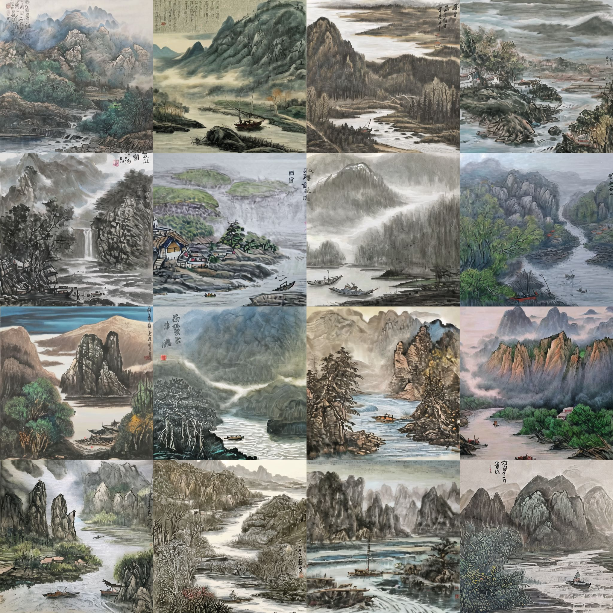

# InkSoul

This is the repository for Ink Soul system.


## Dataset

数据集包含 766 张图片和相应的关键词文本标签，我们提供了数据集的下载链接。

https://zenodo.org/records/14726929

## Model

我们提供了训练好的 LoRA 模型，


input:

```html
<lora:ChineseLandscapePainting:1>,mountain,sunset,house
```

lora:ChineseLandscapePainting:1意味着调用我们的训练好的中国水墨山水画 LoRA 模型，设置 DFG = 3，点击生成按钮

System output:


从11开始，以水为第二主角。【下面的是南方的山水，如桂林山水】【前方的是北方的山水】


## Participant 11  

Participant input:

```html
<lora:ChineseLandscapePainting:1>,mountain,river,fishing boat
```

DFG = 3

System output:




## Participant 12  

Participant input:

```html
<lora:ChineseLandscapePainting:1>,mountain,river,flowers
```

DFG = 3

System output:


## Participant 13  

Participant input:
