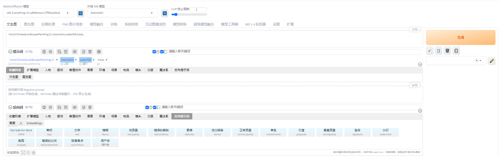
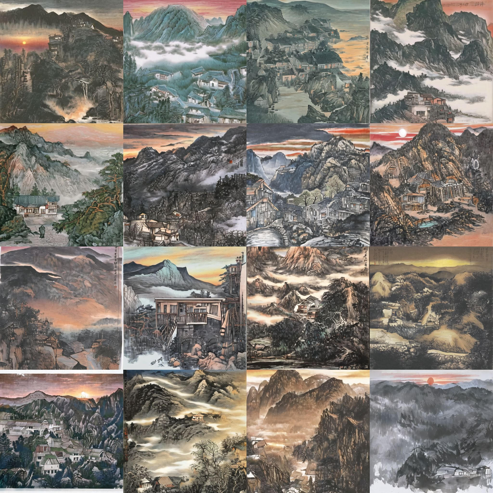
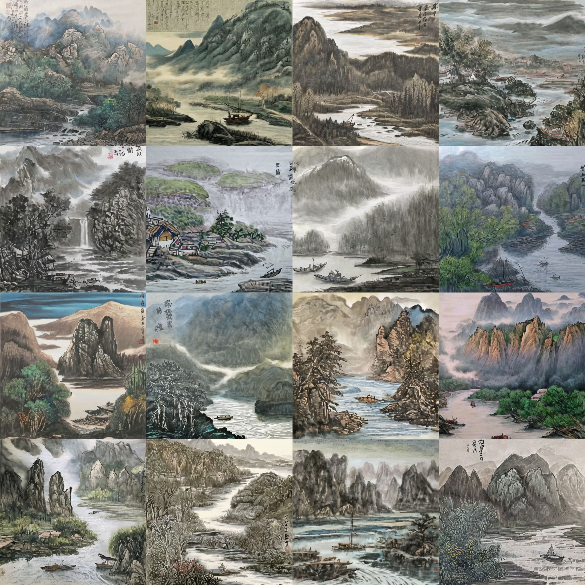

# InkSoul

This is the repository for Ink Soul system.


## Dataset

The dataset contains 766 images and corresponding keyword text labels. We have provided an example of the dataset in the dataset-example folder.

The download link for the complete dataset will be made public after the paper is published.

## Model

We provide the trained LoRA model ChineseLandscapePainting.safetensors, and



We input:

```html
<lora:ChineseLandscapePainting:1>,mountain,sunset,house
```

lora:ChineseLandscapePainting: 1 means calling our trained Chinese ink landscape painting LoRA model, setting DFG=3, and clicking the generate button.

System output:




If we input:

```html
<lora:ChineseLandscapePainting:1>,mountain,river,fishing boat
```

setting DFG=3,

System output:




